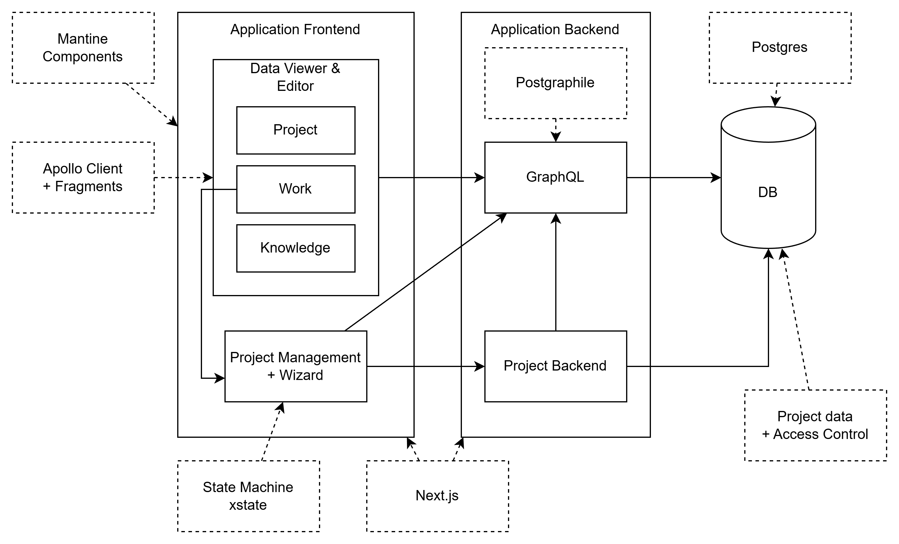

The system is a Next.js‑based project management application with a React frontend, a GraphQL backend (likely PostGraphile-based), and a PostgreSQL database that holds both project data and access control rules.

## Frontend: Application UI

The **Application Frontend** hosts all user-facing features, implemented with Next.js and Mantine UI components.
Within it, a **Data Viewer & Editor** provides three main domains: **Project**, **Work**, and **Knowledge**, all of which consume the GraphQL API via Apollo Client using fragments for type‑safe, reusable data selection.

A separate **Project Management + Wizard** component guides users through structured flows (e.g., project setup, onboarding, complex actions), whose UI states and transitions are orchestrated by XState state machines on the client side.
Both Data Viewer/Editor and the Wizard communicate with the backend GraphQL API; the Wizard may also talk directly to the **Project Backend** service for more workflow‑oriented operations.

## Backend: GraphQL and project service

The **Application Backend** exposes a central **GraphQL** service that fronts the database and mediates access to project data.
PostGraphile (shown as an optional/dotted component) can generate a substantial part of this GraphQL API directly from the PostgreSQL schema, while custom resolvers or stitched schemas can be added around it for domain‑specific behavior.

A dedicated **Project Backend** service handles higher‑level project logic, orchestration, and potentially long‑running processes, invoking the GraphQL layer for data access and being called in turn from the frontend for actions that do not map 1‑to‑1 to simple CRUD operations.
This separation lets the GraphQL layer stay close to the data model while the Project Backend encapsulates workflows, validations, and integrations with other systems if needed.

## Persistence: PostgreSQL and access control

The **DB** is a PostgreSQL instance that stores all core entities (projects, work items, knowledge objects, users, permissions) and is accessed exclusively through the GraphQL layer and any PostGraphile‑generated APIs.
Project data and access control rules are co‑located in this database, enabling row‑level security or similar mechanisms to enforce permissions at query time, which integrates naturally with PostGraphile’s capabilities.

## Cross‑cutting technologies

- **Mantine Components** supply the design system and reusable UI building blocks consumed across the frontend modules.
- **Apollo Client + Fragments** implement client‑side GraphQL data fetching, caching, and normalized storage of entities supporting the Project, Work, and Knowledge views.

- **State Machine (XState)** manages complex UI and business workflows for the Project Management Wizard, ensuring predictable transitions and easier testing.
- **Next.js** underpins routing, server‑side rendering/SSR, and any server components or API routes needed to glue the frontend to the backend GraphQL endpoint.
