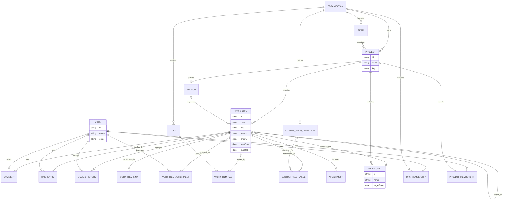

Here is a Mermaid ER diagram for the conceptual project‑management model discussed earlier.[1][2]



```sql
-- Core structure
CREATE TABLE organizations (
  id          UUID PRIMARY KEY,
  name        TEXT NOT NULL
);

CREATE TABLE teams (
  id              UUID PRIMARY KEY,
  organization_id UUID NOT NULL REFERENCES organizations(id),
  name            TEXT NOT NULL
);

CREATE TABLE projects (
  id              UUID PRIMARY KEY,
  organization_id UUID NOT NULL REFERENCES organizations(id),
  team_id         UUID REFERENCES teams(id),
  name            TEXT NOT NULL,
  project_key     TEXT NOT NULL
);

CREATE UNIQUE INDEX projects_org_key_unique
  ON projects(organization_id, project_key);

CREATE TABLE sections (
  id         UUID PRIMARY KEY,
  project_id UUID NOT NULL REFERENCES projects(id),
  name       TEXT NOT NULL,
  position   INTEGER NOT NULL
);

-- Users and memberships
CREATE TABLE users (
  id       UUID PRIMARY KEY,
  name     TEXT NOT NULL,
  email    TEXT NOT NULL UNIQUE
);

CREATE TABLE org_memberships (
  id              UUID PRIMARY KEY,
  organization_id UUID NOT NULL REFERENCES organizations(id),
  user_id         UUID NOT NULL REFERENCES users(id),
  role            TEXT NOT NULL,
  UNIQUE (organization_id, user_id)
);

CREATE TABLE project_memberships (
  id         UUID PRIMARY KEY,
  project_id UUID NOT NULL REFERENCES projects(id),
  user_id    UUID NOT NULL REFERENCES users(id),
  role       TEXT NOT NULL,
  UNIQUE (project_id, user_id)
);

-- Work items
CREATE TABLE work_items (
  id             UUID PRIMARY KEY,
  project_id     UUID NOT NULL REFERENCES projects(id),
  section_id     UUID REFERENCES sections(id),
  parent_id      UUID REFERENCES work_items(id),
  type           TEXT NOT NULL,   -- task, bug, epic, ...
  title          TEXT NOT NULL,
  description    TEXT,
  status         TEXT NOT NULL,
  priority       TEXT,
  start_date     DATE,
  due_date       DATE,
  created_at     TIMESTAMPTZ NOT NULL DEFAULT now(),
  updated_at     TIMESTAMPTZ NOT NULL DEFAULT now()
);

CREATE INDEX work_items_project_idx ON work_items(project_id);
CREATE INDEX work_items_parent_idx  ON work_items(parent_id);

-- Assignments
CREATE TABLE work_item_assignments (
  id           UUID PRIMARY KEY,
  work_item_id UUID NOT NULL REFERENCES work_items(id) ON DELETE CASCADE,
  user_id      UUID NOT NULL REFERENCES users(id),
  role         TEXT NOT NULL,   -- assignee, reviewer, follower
  UNIQUE (work_item_id, user_id, role)
);

-- Comments & history
CREATE TABLE comments (
  id           UUID PRIMARY KEY,
  work_item_id UUID NOT NULL REFERENCES work_items(id) ON DELETE CASCADE,
  author_id    UUID NOT NULL REFERENCES users(id),
  body         TEXT NOT NULL,
  created_at   TIMESTAMPTZ NOT NULL DEFAULT now()
);

CREATE TABLE time_entries (
  id           UUID PRIMARY KEY,
  work_item_id UUID NOT NULL REFERENCES work_items(id) ON DELETE CASCADE,
  user_id      UUID NOT NULL REFERENCES users(id),
  work_date    DATE NOT NULL,
  minutes      INTEGER NOT NULL,
  billable     BOOLEAN NOT NULL DEFAULT false,
  notes        TEXT
);

CREATE TABLE status_history (
  id           UUID PRIMARY KEY,
  work_item_id UUID NOT NULL REFERENCES work_items(id) ON DELETE CASCADE,
  user_id      UUID NOT NULL REFERENCES users(id),
  changed_at   TIMESTAMPTZ NOT NULL DEFAULT now(),
  field        TEXT NOT NULL,
  old_value    TEXT,
  new_value    TEXT
);

-- Links between work items
CREATE TABLE work_item_links (
  id            UUID PRIMARY KEY,
  from_item_id  UUID NOT NULL REFERENCES work_items(id) ON DELETE CASCADE,
  to_item_id    UUID NOT NULL REFERENCES work_items(id) ON DELETE CASCADE,
  link_type     TEXT NOT NULL,  -- blocks, relates_to, ...
  CHECK (from_item_id <> to_item_id)
);

-- Tags
CREATE TABLE tags (
  id              UUID PRIMARY KEY,
  organization_id UUID NOT NULL REFERENCES organizations(id),
  name            TEXT NOT NULL,
  UNIQUE (organization_id, name)
);

CREATE TABLE work_item_tags (
  work_item_id UUID NOT NULL REFERENCES work_items(id) ON DELETE CASCADE,
  tag_id       UUID NOT NULL REFERENCES tags(id) ON DELETE CASCADE,
  PRIMARY KEY (work_item_id, tag_id)
);

-- Milestones
CREATE TABLE milestones (
  id          UUID PRIMARY KEY,
  project_id  UUID NOT NULL REFERENCES projects(id),
  name        TEXT NOT NULL,
  target_date DATE
);

CREATE TABLE work_item_milestones (
  work_item_id UUID NOT NULL REFERENCES work_items(id) ON DELETE CASCADE,
  milestone_id UUID NOT NULL REFERENCES milestones(id) ON DELETE CASCADE,
  PRIMARY KEY (work_item_id, milestone_id)
);

-- Custom fields
CREATE TABLE custom_field_definitions (
  id              UUID PRIMARY KEY,
  organization_id UUID NOT NULL REFERENCES organizations(id),
  name            TEXT NOT NULL,
  field_type      TEXT NOT NULL,   -- text, number, select, date, json, ...
  config          JSONB,           -- options, min/max, etc.
  UNIQUE (organization_id, name)
);

CREATE TABLE custom_field_values (
  id                        UUID PRIMARY KEY,
  work_item_id              UUID NOT NULL REFERENCES work_items(id) ON DELETE CASCADE,
  custom_field_definition_id UUID NOT NULL REFERENCES custom_field_definitions(id),
  value_text                TEXT,
  value_number              NUMERIC,
  value_date                DATE,
  value_json                JSONB,
  UNIQUE (work_item_id, custom_field_definition_id)
);

-- Attachments
CREATE TABLE attachments (
  id           UUID PRIMARY KEY,
  work_item_id UUID REFERENCES work_items(id) ON DELETE CASCADE,
  comment_id   UUID REFERENCES comments(id) ON DELETE CASCADE,
  project_id   UUID REFERENCES projects(id) ON DELETE CASCADE,
  url          TEXT NOT NULL,
  file_name    TEXT NOT NULL,
  content_type TEXT,
  size_bytes   BIGINT
);
```

```sql
-- Organizations
INSERT INTO organizations (id, name) VALUES
  ('00000000-0000-0000-0000-000000000001', 'Acme Corp'),
  ('00000000-0000-0000-0000-000000000002', 'Globex Ltd');

-- Teams
INSERT INTO teams (id, organization_id, name) VALUES
  ('00000000-0000-0000-0000-000000000101', '00000000-0000-0000-0000-000000000001', 'Platform Team'),
  ('00000000-0000-0000-0000-000000000102', '00000000-0000-0000-0000-000000000001', 'Product Team');

-- Projects
INSERT INTO projects (id, organization_id, team_id, name, project_key) VALUES
  ('00000000-0000-0000-0000-000000000201', '00000000-0000-0000-0000-000000000001',
   '00000000-0000-0000-0000-000000000101', 'Project Atlas', 'ATLAS'),
  ('00000000-0000-0000-0000-000000000202', '00000000-0000-0000-0000-000000000001',
   '00000000-0000-0000-0000-000000000102', 'Project Borealis', 'BOR');

-- Sections
INSERT INTO sections (id, project_id, name, position) VALUES
  ('00000000-0000-0000-0000-000000000301', '00000000-0000-0000-0000-000000000201', 'Backlog', 1),
  ('00000000-0000-0000-0000-000000000302', '00000000-0000-0000-0000-000000000201', 'In Progress', 2),
  ('00000000-0000-0000-0000-000000000303', '00000000-0000-0000-0000-000000000201', 'Done', 3);

-- Users
INSERT INTO users (id, name, email) VALUES
  ('00000000-0000-0000-0000-000000000401', 'Alice Martin', 'alice@acme.test'),
  ('00000000-0000-0000-0000-000000000402', 'Bob Dupont', 'bob@acme.test'),
  ('00000000-0000-0000-0000-000000000403', 'Charlie Durand', 'charlie@acme.test');

-- Org memberships
INSERT INTO org_memberships (id, organization_id, user_id, role) VALUES
  ('00000000-0000-0000-0000-000000000501', '00000000-0000-0000-0000-000000000001',
   '00000000-0000-0000-0000-000000000401', 'owner'),
  ('00000000-0000-0000-0000-000000000502', '00000000-0000-0000-0000-000000000001',
   '00000000-0000-0000-0000-000000000402', 'member'),
  ('00000000-0000-0000-0000-000000000503', '00000000-0000-0000-0000-000000000001',
   '00000000-0000-0000-0000-000000000403', 'member');

-- Project memberships
INSERT INTO project_memberships (id, project_id, user_id, role) VALUES
  ('00000000-0000-0000-0000-000000000601', '00000000-0000-0000-0000-000000000201',
   '00000000-0000-0000-0000-000000000401', 'manager'),
  ('00000000-0000-0000-0000-000000000602', '00000000-0000-0000-0000-000000000201',
   '00000000-0000-0000-0000-000000000402', 'contributor'),
  ('00000000-0000-0000-0000-000000000603', '00000000-0000-0000-0000-000000000201',
   '00000000-0000-0000-0000-000000000403', 'contributor');

-- Work items (epic + stories + subtask)
INSERT INTO work_items
(id, project_id, section_id, parent_id, type, title, description,
 status, priority, start_date, due_date, created_at, updated_at)
VALUES
  -- Epic
  ('00000000-0000-0000-0000-000000000701',
   '00000000-0000-0000-0000-000000000201',
   '00000000-0000-0000-0000-000000000301',
   NULL,
   'epic',
   'Atlas MVP',
   'Deliver the first version of Atlas',
   'In Progress',
   'High',
   '2025-12-01',
   '2026-02-01',
   now(), now()),

  -- Story 1
  ('00000000-0000-0000-0000-000000000702',
   '00000000-0000-0000-0000-000000000201',
   '00000000-0000-0000-0000-000000000302',
   '00000000-0000-0000-0000-000000000701',
   'story',
   'User authentication',
   'Implement sign‑up, login, and password reset',
   'In Progress',
   'High',
   '2025-12-02',
   '2025-12-20',
   now(), now()),

  -- Story 2
  ('00000000-0000-0000-0000-000000000703',
   '00000000-0000-0000-0000-000000000201',
   '00000000-0000-0000-0000-000000000301',
   '00000000-0000-0000-0000-000000000701',
   'story',
   'Project board',
   'Create Kanban board for tasks',
   'To Do',
   'Medium',
   NULL,
   '2026-01-10',
   now(), now()),

  -- Subtask of Story 1
  ('00000000-0000-0000-0000-000000000704',
   '00000000-0000-0000-0000-000000000201',
   '00000000-0000-0000-0000-000000000302',
   '00000000-0000-0000-0000-000000000702',
   'task',
   'Add JWT validation middleware',
   'Protect API endpoints with JWT',
   'In Progress',
   'High',
   '2025-12-05',
   '2025-12-12',
   now(), now());

-- Assignments
INSERT INTO work_item_assignments (id, work_item_id, user_id, role) VALUES
  ('00000000-0000-0000-0000-000000000801',
   '00000000-0000-0000-0000-000000000702',
   '00000000-0000-0000-0000-000000000402', 'assignee'),
  ('00000000-0000-0000-0000-000000000802',
   '00000000-0000-0000-0000-000000000702',
   '00000000-0000-0000-0000-000000000401', 'reviewer'),
  ('00000000-0000-0000-0000-000000000803',
   '00000000-0000-0000-0000-000000000704',
   '00000000-0000-0000-0000-000000000403', 'assignee');

-- Comments
INSERT INTO comments (id, work_item_id, author_id, body, created_at) VALUES
  ('00000000-0000-0000-0000-000000000901',
   '00000000-0000-0000-0000-000000000702',
   '00000000-0000-0000-0000-000000000402',
   'Initial auth endpoints pushed to feature branch.',
   now()),
  ('00000000-0000-0000-0000-000000000902',
   '00000000-0000-0000-0000-000000000704',
   '00000000-0000-0000-0000-000000000403',
   'JWT middleware implemented, needs review.',
   now());

```

This stays at conceptual level: key entities, main relationships, and only a few illustrative attributes without implementation details or data types beyond very generic ones.[3][4]

[1](https://docs.mermaidchart.com/mermaid-oss/syntax/entityRelationshipDiagram.html)
[2](https://docs.mermaidviewer.com/diagrams/er.html)
[3](https://airbyte.com/data-engineering-resources/conceptual-data-model)
[4](https://www.baeldung.com/sql/design-conceptual-data-model)
[5](https://docs.mermaidchart.com/blog/posts/7-er-diagram-examples-for-database-modeling-from-mermaid-ai)
[6](https://mermaid.js.org/syntax/classDiagram.html)
[7](https://hackolade.com/help/GenAI-createdMermaidERdiagram.html)
[8](https://clickup.com/blog/mermaid-diagram-examples/)
[9](https://arrt.uk.com/from-concept-to-code-crafting-er-models-and-code-with-ai/)
[10](https://erstudio.com/blog/how-conceptual-data-modeling-bridges-your-business-and-data/)
[11](https://miro.com/diagramming/what-is-mermaid/)
[12](https://mermaid.js.org/syntax/architecture.html)
[13](https://mermaid.js.org)
[14](https://stackoverflow.com/questions/76866180/mermaid-er-diagram-styling)
[15](https://www.linkedin.com/pulse/building-project-management-data-model-step-by-step-guide-hassan-4c4yf)
[16](https://docs.github.com/en/get-started/writing-on-github/working-with-advanced-formatting/creating-diagrams)
[17](https://victoronsoftware.com/posts/mermaid-intro/)
[18](https://www.owox.com/blog/articles/conceptual-data-modeling-with-examples)
[19](https://www.drawio.com/blog/mermaid-diagrams)
[20](https://www.solidpepper.com/en/blog/conceptual-data-model-complete-guide)