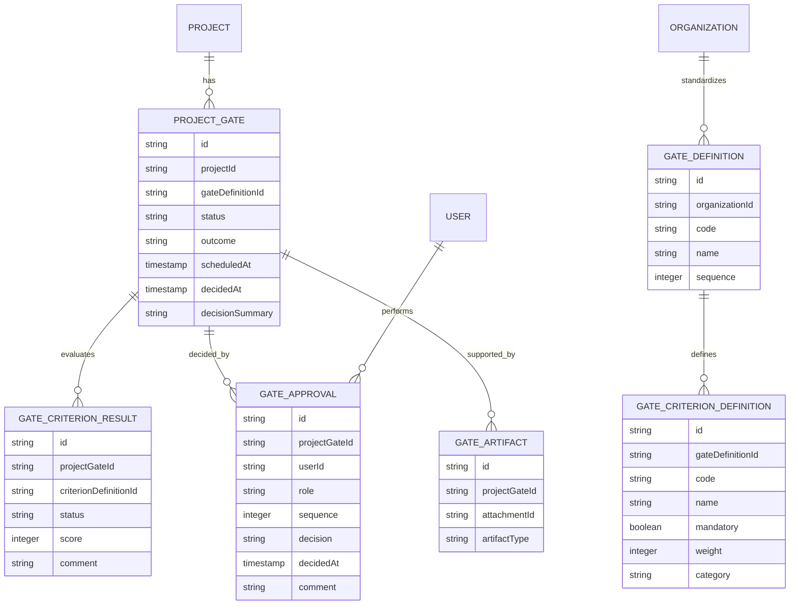

The existing model covers work tracking but not the explicit “gate / approval / criteria / decision” concepts needed for GO / NO‑GO for build.[1][2]

Below is an updated conceptual model plus concrete tables, focused on GO‑NO‑GO concerns.

## New conceptual entities

Add these entities and relationships on top of your current ER:



This lets you: define standard gates per org, instantiate a “GO / NO‑GO for build” for a given project, evaluate criteria, capture approvals, and link evidence.[3][1]

## SQL extensions

### 1. Gate definitions and instances

```sql
CREATE TABLE gate_definitions (
  id              UUID PRIMARY KEY,
  organization_id UUID NOT NULL REFERENCES organizations(id),
  code            TEXT NOT NULL,       -- e.g. 'GO_BUILD'
  name            TEXT NOT NULL,       -- 'GO / NO-GO for Build'
  description     TEXT,
  sequence        INTEGER NOT NULL,    -- order in lifecycle
  UNIQUE (organization_id, code)
);

CREATE TABLE project_gates (
  id                UUID PRIMARY KEY,
  project_id        UUID NOT NULL REFERENCES projects(id),
  gate_definition_id UUID NOT NULL REFERENCES gate_definitions(id),
  status            TEXT NOT NULL,     -- pending, in_review, decided
  outcome           TEXT,              -- go, no_go, hold, recycle
  scheduled_at      TIMESTAMPTZ,
  decided_at        TIMESTAMPTZ,
  decision_summary  TEXT,
  created_at        TIMESTAMPTZ NOT NULL DEFAULT now(),
  updated_at        TIMESTAMPTZ NOT NULL DEFAULT now(),
  UNIQUE (project_id, gate_definition_id)
);
```

`gate_definitions` standardize gates like “GO_BUILD” and “GO_RELEASE”; `project_gates` are the actual GO / NO‑GO events per project.[4][1]

### 2. Criteria definitions and results

```sql
CREATE TABLE gate_criterion_definitions (
  id                 UUID PRIMARY KEY,
  gate_definition_id UUID NOT NULL REFERENCES gate_definitions(id) ON DELETE CASCADE,
  code               TEXT NOT NULL,    -- 'FUNDING_SECURED'
  name               TEXT NOT NULL,
  description        TEXT,
  category           TEXT NOT NULL,    -- strategy, financial, technical, risk, org
  mandatory          BOOLEAN NOT NULL DEFAULT true,
  weight             INTEGER NOT NULL DEFAULT 0,
  position           INTEGER NOT NULL,
  UNIQUE (gate_definition_id, code)
);

CREATE TABLE gate_criterion_results (
  id                        UUID PRIMARY KEY,
  project_gate_id           UUID NOT NULL REFERENCES project_gates(id) ON DELETE CASCADE,
  gate_criterion_definition_id UUID NOT NULL REFERENCES gate_criterion_definitions(id) ON DELETE CASCADE,
  status                    TEXT NOT NULL,   -- pass, fail, partial, not_applicable
  score                     INTEGER,         -- optional numeric score
  comment                   TEXT,
  UNIQUE (project_gate_id, gate_criterion_definition_id)
);
```

This models the rule set (definitions) and the evaluation for a specific GO / NO‑GO for build (results), enabling weighted scoring and mandatory “knockout” rules.[5][6]

### 3. Approvers and approvals

```sql
CREATE TABLE gate_approvals (
  id             UUID PRIMARY KEY,
  project_gate_id UUID NOT NULL REFERENCES project_gates(id) ON DELETE CASCADE,
  user_id        UUID NOT NULL REFERENCES users(id),
  role           TEXT NOT NULL,      -- sponsor, architect, finance, security
  sequence       INTEGER NOT NULL,   -- for ordered workflows
  decision       TEXT,               -- approve, reject, abstain
  decided_at     TIMESTAMPTZ,
  comment        TEXT,
  UNIQUE (project_gate_id, user_id, role)
);
```

This is your approval workflow and audit trail for GO / NO‑GO: who approved/rejected, in what role, when, and with which comment.[7][3]

### 4. Evidence and linkage to artifacts

Reuse `attachments` but add a join table to bind evidence to the gate:

```sql
CREATE TABLE gate_artifacts (
  id             UUID PRIMARY KEY,
  project_gate_id UUID NOT NULL REFERENCES project_gates(id) ON DELETE CASCADE,
  attachment_id  UUID NOT NULL REFERENCES attachments(id) ON DELETE CASCADE,
  artifact_type  TEXT NOT NULL,  -- business_case, architecture_review, risk_register, etc.
  UNIQUE (project_gate_id, attachment_id)
);
```

This lets you say “this business case, this architecture review, and this risk register were the evidence package for this GO / NO‑GO for build decision”.[8][1]

## How this specifically supports GO / NO‑GO for build

For the “GO / NO‑GO for build” gate in particular, you would typically:

- Create a `gate_definitions` row `code='GO_BUILD'`, with criteria definitions like “Architecture approved”, “Funding secured”, “Risks acceptable”, “Key roles staffed”, “Requirements ready”.[9][10]
- For each project, instantiate one `project_gates` row for that definition when approaching build.  
- Evaluate criteria into `gate_criterion_results`, using `mandatory` and `weight` to implement your rule set and scorecard.[6][5]
- Collect approvals (sponsor, architect, finance, security) into `gate_approvals`, and link supporting documents using `gate_artifacts`.[1][3]

If you want, the next step can be a couple of concrete insert examples for a GO_BUILD gate on “Project Atlas” using your existing sample data.

[1](https://www.mastt.com/resources/stage-gate-process-template)
[2](https://www.ntaskmanager.com/blog/go-no-go-decision-in-project-management/)
[3](https://kissflow.com/workflow/approval-process/)
[4](https://www.projectmanager.com/blog/phase-gate-process)
[5](https://www.inventive.ai/blog-posts/go-no-go-decision-projects)
[6](https://www.hso.com/whitepaper/automating-gono-go-processes-to-optimize-pursuit-decisions/automating-gono-go-process-to-optimize-pursuit-decisions)
[7](https://ziphq.com/blog/how-to-create-an-approval-workflow)
[8](https://www.mckinsey.com/capabilities/operations/our-insights/make-milestones-matter-with-decision-gatesstage-gates-with-real-teeth)
[9](https://www.managebt.org/wp-content/uploads/06_Gate_Based_Project_Management.pdf)
[10](https://www.stage-gate.com/blog/the-stage-gate-model-an-overview/)
[11](https://unanet.com/blog/quick-tips-to-improve-your-go-no-go-assessment)
[12](https://learn.microsoft.com/en-us/dynamics365/developer/reference/entities/opportunity)
[13](https://www.breezedocs.ai/posts/go-no-go-decision-template)
[14](https://tdan.com/data-modeling-enterprise-project-management-part-1-estimation/5164)
[15](https://www.anydb.com/blog/approval-workflow-101/)
[16](https://www.mindtools.com/a3p0zmp/gono-go-decisions/)
[17](https://precoro.com/blog/approval-workflow/)
[18](https://www.anao.gov.au/work/performance-audit/governance-of-artificial-intelligence-the-australian-taxation-office)
[19](https://blogs.yoroflow.com/stage-gate-process-in-project-management/)
[20](https://help.sap.com/docs/SAP_S4HANA_CLOUD/a376cd9ea00d476b96f18dea1247e6a5/8f9394bad4f946fca8fd3f1b46ed60e7.html)
[21](https://pdhacademy.com/wp-content/uploads/2024/01/524-Stage_Gate_Project_Management.pdf)
